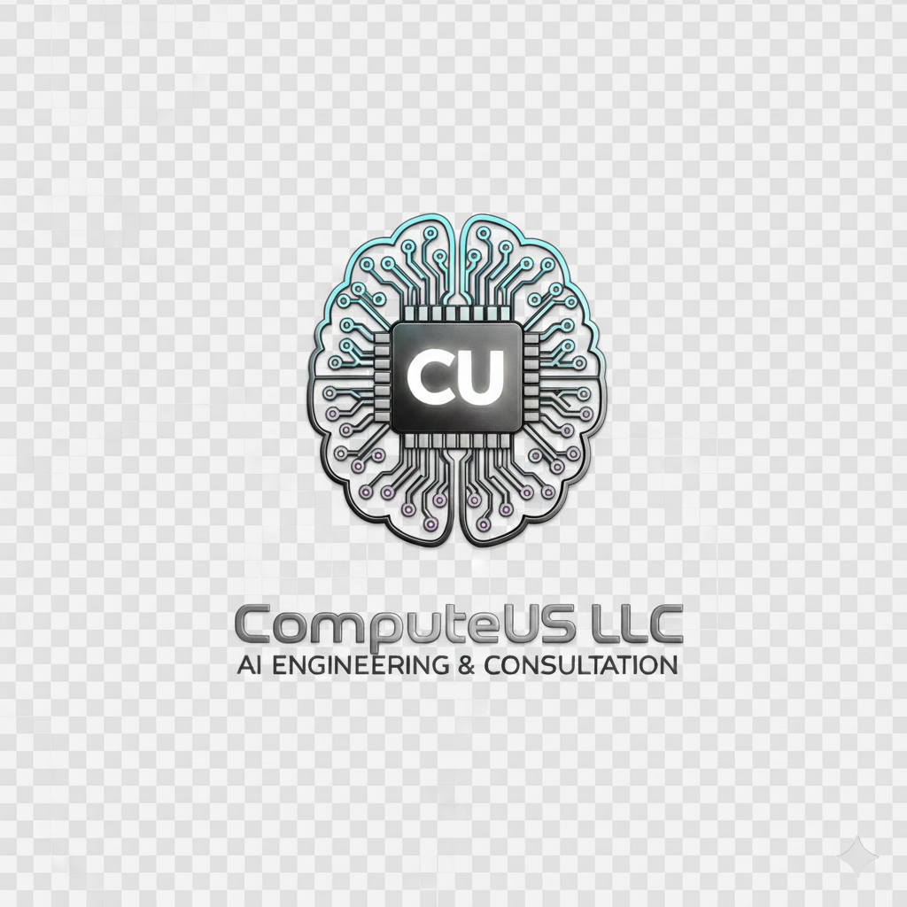

	

# ComputeUS LLC: Architecting the Future of Private AI

Welcome. This repository represents more than just code; it's a reflection of our core philosophy as a company. We're here to build a new foundation for enterprise AI—one where innovation and control are no longer mutually exclusive.

This is the central hub for our ideas, our principles, and our vision for what's next.

## Our Core Thesis: The Private Infrastructure Advantage

In a world rushing to the public cloud, we've taken a different, more deliberate path. We believe that for businesses where data is a core asset, true innovation shouldn't require a compromise on security or control. This belief is the foundation of our work, and it's built on three key pillars:

1. Security by Design.

Our solutions are architected on private, on-premise hardware. This isn't just a feature; it's a promise. Your data, your models, and your competitive advantage remain exactly that—yours.

2. Predictability in Practice.

The volatile, usage-based billing of the cloud is a barrier to innovation. We operate on a model of fixed-price projects and predictable partnerships, so you can focus on building your advantage, not on managing your bill.

3. Performance without Compromise.

By controlling the entire stack, from the silicon to the software, we build highly optimized, bespoke AI systems that are tuned to solve your specific challenges, delivering a level of performance that generic APIs simply can't match.

## Our Practice

We are architects and engineers, translating complex challenges into durable, technological assets. Our work is focused on delivering a material advantage to our clients, moving beyond consultation to create systems that become a core part of their operational fabric.

Our engagements range from developing deeply integrated custom AI solutions to the full-scale, end-to-end development of industry-specific SaaS platforms. We are not just service providers; we are long-term strategic partners in building the future of your business.

## An Invitation

This is the beginning of a conversation. If you are a leader, an innovator, or an engineer who believes in building technology that lasts—and that a company's most valuable data deserves a secure, sovereign foundation—then our principles are aligned.

We invite you to connect with us.

Explore our work and begin a conversation at contactus@computeusllc.com